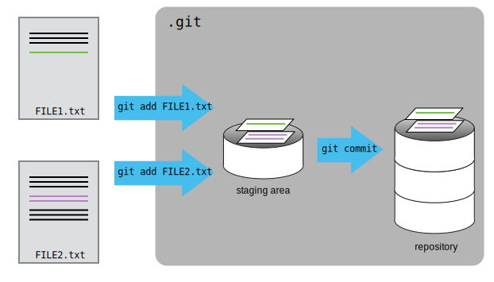

To recap, when we want to add changes to our repository, we first need to add the changed files to the staging area (`git add`) and then commit the staged changes to the repository (`git commit`):

## Key Points
- `git status` shows the status of a repository.
- Files can be stored in a project’s working directory (which users see), the staging area (where the next commit is being built up) and the local repository (where commits are permanently recorded).
- `git add` puts files in the staging area.
- `git commit` saves the staged content as a new commit in the local repository.
- Write a commit message that accurately describes your changes.
