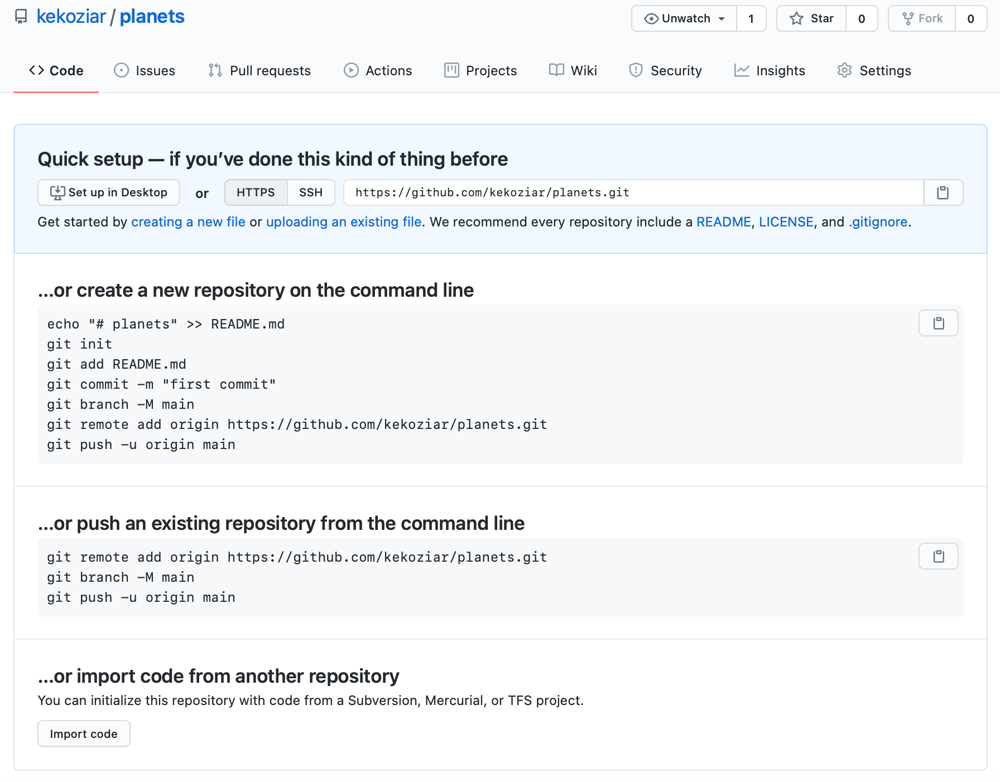

Version control really comes into its own when we begin to collaborate with other people. We already have most of the machinery we need to do this; the only thing missing is to copy changes from one repository to another.

Systems like Git allow us to move work between any two repositories. In practice, though, it’s easiest to use one copy as a central hub, and to keep it on the web rather than on someone’s laptop. Most programmers use hosting services like [GitHub](https://github.com/), [Bitbucket](https://bitbucket.org/) or [GitLab](https://about.gitlab.com/) to hold those main copies; we’ll explore the pros and cons of this in a later episode.

Let’s start by sharing the changes we’ve made to our current project with the world. <b> Log in to GitHub </b>, then click on the icon in the top right corner to create a new repository called `planets`:


Name your repository “planets” and then click “Create Repository”.

Note: Since this repository will be connected to a local repository, it needs to be empty. Leave “Initialize this repository with a README” unchecked, and keep “None” as options for both “Add .gitignore” and “Add a license.” See the “GitHub License and README files” exercise below for a full explanation of why the repository needs to be empty.


As soon as the repository is created, GitHub displays a page with a URL and some information on how to configure your local repository:



The above actions are the same as the Git codes:
> ```
> mkdir planets
> cd planets
> git init
> ```

<br/>

If you remember back to the earlier episode where we added and committed our earlier work on `mars.txt`, we had a diagram of the local repository which looked like this:


Now that we have two repositories, we need a diagram like this:


Note that our local repository still contains our earlier work on `mars.txt`, but the remote repository on GitHub appears empty as it doesn’t contain any files yet.

<br/>
