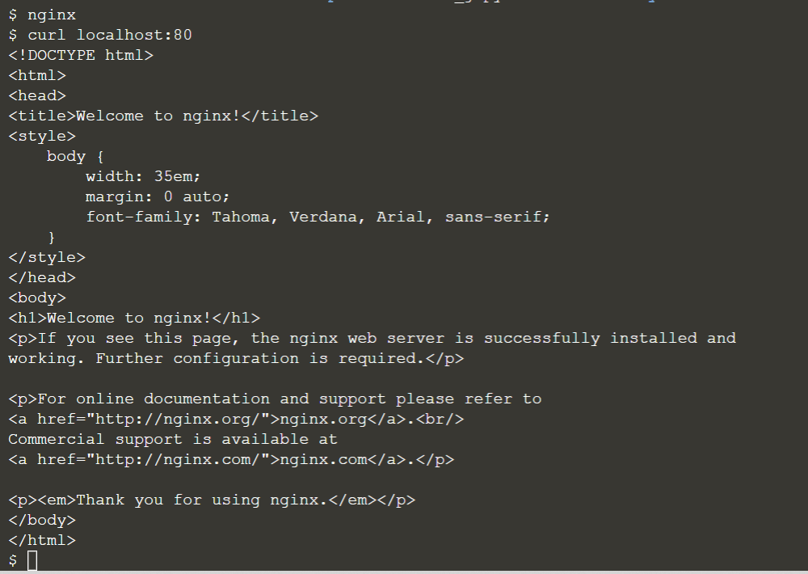

## Install software packages

To handle the procedures in using a software package, we will use `apt` command (a command line package manager) to operate: 
- Update list of available packages: `apt update`{{copy}}
- Install the package: `apt install <package name>`{{copy}}
- Uninstall the package: `apt remove <package name>`{{copy}}
- Update only a single app: `apt update <package name>`{{copy}}

 

##### Example:
1. Update list of available packages: apt update

2. Install the package (here we install nginx web server): apt install nginx

3. Run the nginx web server: nginx

4. Check the default website using `curl`: curl localhost:80

 

Sample output:

 

You can try to look upon each package available by:
> apt list

Also, you can search the details of a particular package by:
> `apt show <package name>`{{copy}}

For example, we can find the details of **nginx** package:
> apt show nginx

 
