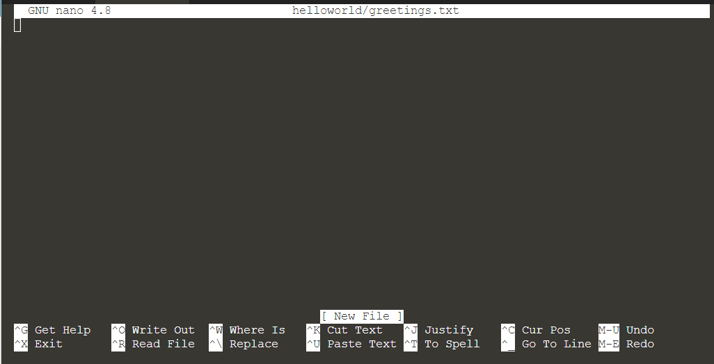
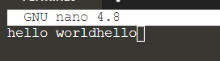

## Using Nano

Nano is a text editor to create, amend and update file content. To open `nano` with an empty buffer, we can just type `nano`{{copy}} in the terminal. You can also create a new buffer with the designated directory and filename. Let's make it to:
> `ls`{{execute}}
> 
> `nano helloworld/greetings.txt`{{execute}}

Let's take a look at the default nano screen.

Several sections in the screen:
1. Name and version number at the top
2. Name of file you are editing
3. Content 
4. Executing status of your file at the bottom with [ ]
5. Shortcuts 

## Shortcuts in Nano editor

There are various shortcuts available in nano and the most common ones are listed at the bottom of the screen. 

The shortcuts are used with <kbd> Ctrl </kbd> / <kbd> Alt </kbd> and another letter. The common shortcuts function as:
- <kbd> Ctrl + G </kbd>: View all the shortcut functions
- <kbd> Ctrl + R </kbd>: Insert the contents of another file into your current buffer
- <kbd> Alt + 6 </kbd>: Copy text
- <kbd> Ctrl + K </kbd>: Cut text
- <kbd> Ctrl + U </kbd>: Paste text
- <kbd> Alt + U </kbd>: Undo
- <kbd> Alt + E </kbd>: Redo
- <kbd> Ctrl + X </kbd>: Exit the editor (system will ask for saving)
- <kbd> Ctrl + Z </kbd>: Stop the editor

We will now try these shortcuts. First, in the editor, we type `hello world`{{copy}} to add content. 

To mark a text, press <kbd> SHIFT </kbd> continuously while selecting the text with the arrow keys. The sample output is as follow:

To copy the marked text press <kbd> Alt + 6 </kbd>.

To paste the marked text, move the cursor to a suitable position and press <kbd> Ctrl + U </kbd>. The sample output is as follow:

We can click <kbd> Alt + U </kbd> to undo and <kbd> Alt + E </kbd> to redo.

To save the file, click <kbd> Ctrl + X </kbd> and click <kbd> Y </kbd>. Press <kbd> ENTER </kbd> when you sure the content is saved in the correct file.

 
