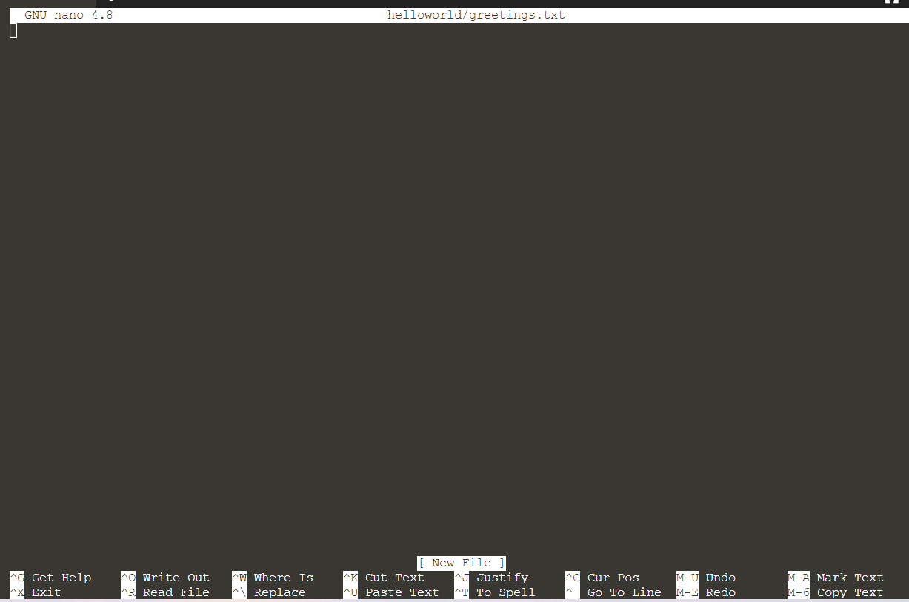

## Using Nano

Nano is a text editor to create, amend and update file content. To open `nano` with an empty buffer, we can just type `nano`{{copy}} in the terminal. You can also create a new buffer with the designated directory and filename. Let's make it to:
> `ls`{{execute}}
> 
> `nano helloworld/greetings.txt`{{execute}}

Let's take a look at the default nano screen.

Several sections in the screen:
1. Name and version number at the top
2. Name of file you are editing
3. Content 
4. Executing status of your file at the bottom with [ ]
5. Shortcuts 

## Shortcuts in Nano editor

There are various shortcuts available in nano and the most common ones are listed at the bottom of the screen. 

The shortcuts are used with <kbd> ctrl </kbd> and another letter. The common shortcuts function as:
- <kbd> ctrl + G </kbd>: View all the shortcut functions
- <kbd> ctrl + G </kbd>: 
