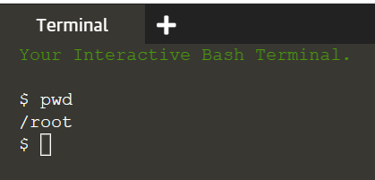
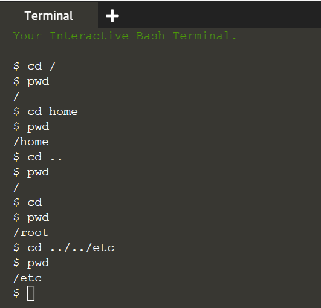

## Basics
You can see the terminal is started on the right section. Let's run our first command. Make sure your keystrokes are on the terminal, then execute the following command:
> pwd

You should see a directory path printed out (probably something like `/root`).

From the picture, we have a couple of basics to understand. 
- The $ (**_prompt_**) is there to tell you the terminal is ready to accept a command. 
- Output will directly show in the terminal after executed commands.

 

## The importance of case
Be extra careful with case when typing in the command line. Typing `PWD` instead of `pwd` will produce an error, but sometimes the wrong case can result in a command appearing to run, but not doing what you expected.

 

## A sense of location
Now to the command itself. `pwd` is an abbreviation of ‘**p**rint **w**orking **d**irectory’. All it does is print out the shell’s current _working directory_. One important concept to understand is that the shell has a notion of a default location in which any file operations will take place. 

If you do any actions, the shell will assume the actions perform in the current working directory unless you take steps to specify otherwise. Therefore, keep in mind of what directory the shell is in at anytime, especially when you want to delete files. If you have any doubt, the `pwd` command will tell you exactly what the current working directory is.

 

## Change working directory using the `cd` command

You can change the working directory using the cd command, an abbreviation for ‘change directory’. Try typing the following:
> cd /
> 
> pwd

Now your working directory is "/". The “/” directory, often referred to as the **_root_** directory, is the base of that unified file system. From there everything else branches out to form a tree of directories and subdirectories.

From the root directory, the following command will move you into the “home” directory:
> cd home
> 
> pwd

To go up to the parent directory (in this case back to "/"), we will use the special syntax of two dots (`..`) when changing directory. Be cautious of the space between `cd` and `..`:
> cd ..
> 
> pwd

A quick shortcut to get back to your home directory is:
> cd
> 
> pwd

You can also use .. more than once if you have to move up through multiple levels of parent directories, which we will go straight to the "etc" directory:
> cd ../../etc
> 
> pwd

Sample output of the above commands:

 

## Relative and absolute paths

Most of the examples in the previous steps use **_relative_** paths. That is, the place you end up at depends on your currect working directory. Try the following to see the difference:
> cd /
> 
> pwd
> 
> cd etc
> 
> pwd

> cd
> 
> pwd
> 
> cd etc
> 
> pwd

You will see an error saying "No such file or directory". Changing directory by specifying the directory name, or using `..` will have different effects depending on where you start from. The path only makes sense **_relative_** to your working directory.

 

In fact any path that starts with a forward slash is an absolute path. So, for the second execution, we should add a "/" to indicate the absolute path for the "etc" directory:
> cd
> 
> pwd
> 
> cd /etc
> 
> pwd

Also, we can use `whoami` command to remind your home directory:
> whoami

At last, there is a handy shortcut which works as an abolute path. Using the tilde character (”~”) at the start of your path similarly means “starting from my home directory”.
> cd ~
> 
> pwd

 
