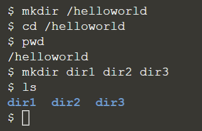

## Creating folders and files

We will create a new directory **_helloworld_** for our test area:
> ```
> mkdir /helloworld
> cd /helloworld
> pwd
> ```{{execute}}

Let's create a few subdirectories (make sure you are in **_helloworld_** directory):
> `mkdir dir1 dir2 dir3`{{execute}}

For some commands, we need to add **_parameters_** or **_arguments_**. `mkdir` command expects at least one argument, whereas the `cd` command can work with zero or one.  

<br/> 

Back to our new directories. The command above will have created three new subdirectories inside our folder. Let’s take a look at them with the ls (list) command:
> `ls`{{execute}}

If you have followed the last few commands, you will get something like this:



Noted that `mkdir` created three folders in one directory. If we want to create nested structure, we can try the following:
> ```
> mkdir -p dir4/dir5/dir6
> ls
> ```{{execute}}

You will see only **_dir4_** is added in the list, because:
- **_dir5_** is in **_dir4_**
- **_dir6_** is in **_dir5_**

And we can try: 
> ```
> cd dir4
> ls
> cd dir5
> ls
> cd ../..
> ```{{execute}}

When we create nested structure with `mkdir` command, the 'p' that we used is called an **_option_** or a **_switch_**. It is to:
- modify how a command operates
- allow a single command to behave in a variety of different ways

To create a folder with a space in the name, we got serveral methods to do so:
> ```
> mkdir "folder 1"
> mkdir 'folder 2'
> mkdir -p folder\ 3/folder\ 4
> ls
> ```{{execute}}

At a good practice, we would use underscores ("_") or hyphens("-") instead of space.

<br/>
