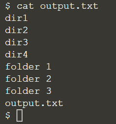

## Creating files using redirection

Now, we will look into creating files. First, remind yourself what the `ls` command is currently showing:
> `ls`{{execute}}

Suppose we would like to create a text file. We can use a new command - `echo`. It is used to print its arguments out on the terminal, and combining it with a redirect. To write in the content in the text file, we can simply use ">" symbol:
> `echo "This is the first text file." > text1.txt`{{execute}}
> 
> `echo "This is the second text file." > text2.txt`{{execute}}
> 
> `ls`{{execute}}

Then, we can see the file content with the `cat` command:
> `cat text1.txt`{{execute}}
> 
> `cat text2.txt`{{execute}}

Sample output:



Also, some shortcuts, or wildcard characters, can save typing if the files have similar names. 
- A question mark ("?"): indicate any **_single character_** within the file name
- An asterisk ("*"): indicate zero or more characters

Examples:
> `cat text1.txt text2.txt`{{execute}}
> 
> `cat text?.txt`{{execute}}
> 
> `cat text*`{{execute}}

When you would like to **append** to the content of the files, we will do with ">>":
> ```
> echo "I've appended a line!" >> combined.txt
> cat combined.txt
> ```{{execute}}

<br/>

## A note about case

Unix systems are case-sensitive. The following is an example, where we will have three different files created:
> ```
> echo "Lower case" > a.txt
> echo "Upper case" > A.TXT
> echo "Mixed case" > A.txt
> ls
> ```{{execute}}

Generally you should try to avoid creating files and folders whose name only varies by case. A good naming practice is like:
- keep file names all lower case
- with only letters, numbers, underscores and hyphens

<br/>
