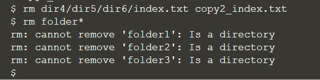

## Deleting files and folders

At this stage, we will delete files:
> ```
> rm dir4/dir5/dir6/combined.txt copy2_combined.txt
> ```{{execute}}

And we can try to delete directories:
> ```
> rm folder*
> ```{{execute}}

Sample output:



As we used wildcard character in the directory removal, the system has triggered a safety net to prevent accidental delete. As a result, in order to remove a directory (**after serious consideration**), we can use `rmdir` command to do the job:
> ```
> rmdir folder*
> ls
> ```{{execute}}

<br/>

Nevertheless, we can still see an error from the terminal, saying "failed to remove 'folder3': Directory not empty". It is because **_'folder 3'_** contains **_'folder 4'_**, so the system may want to safeguard that the directories with files or folders will not be deleted that easily. If you are really sure to remove a whole directory and anything within it, we add the `-r` switch:
> ```
> rm -r 'folder 3'
> ls
> ```{{execute}}

Remember: although `rm -r` is quick and convenient, it’s also dangerous. It’s safest to explicitly delete files to clear out a directory, then `cd ..` to the parent before using `rmdir` to remove it.

<br/>

## Hidden files

Linux systems commonly stores settings and configuration data as hidden files so that they do not clutter the view of your own files. To create a hidden file, simply starting a name with a dot (".") is enough to make it disappear:
> ```
> echo "Hello I am a hidden file." > .hidden.txt
> ls
> ```{{execute}}

You can still work with the hidden file. Make sure you include the dot when you specify its file name:
> `cat .hidden.txt`{{execute}}
> 
> `mkdir .hidden`{{execute}}
> 
> `mv .hidden.txt .hidden`{{execute}}
> 
> `less .hidden/.hidden.txt`{{execute}}

If you run `ls`, it is obvious that we can see nothing. You can still use `ls .hidden` to check the contents. Also, we can use the `-a` switch to `ls` to make it show everything in a directory, including the hidden files and folders:
> `ls`{{execute}}
> 
> `ls -a`{{execute}}
> 
> `ls .hidden`{{execute}}
> 
> `ls -a .hidden`{{execute}}

<br/>

You shouldn’t usually need to deal with hidden files, but occasionally instructions might require you to `cd` into `.config`, or edit some file whose name starts with a dot.

<br/>
