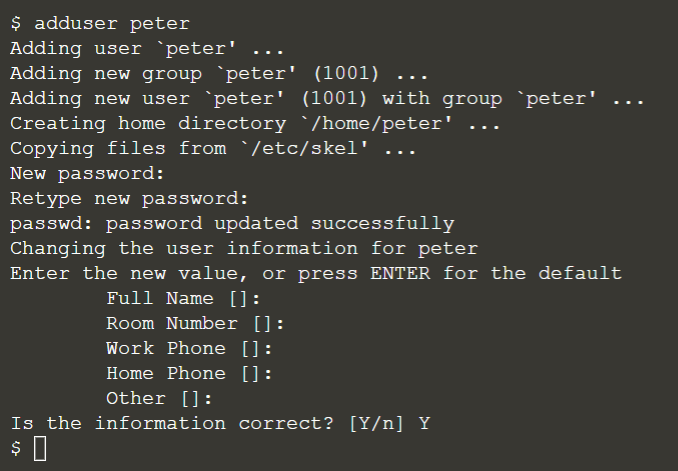
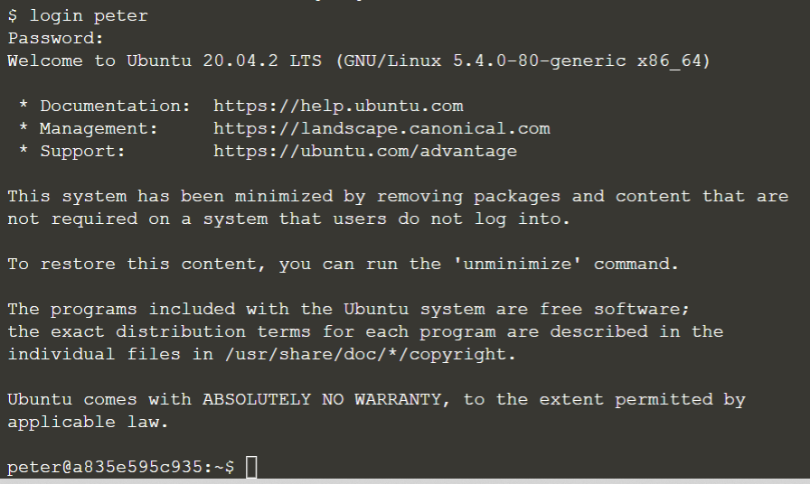
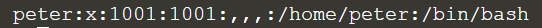

## Create users and login

In Linux terminal, we can create user account to access stored files and folders privately. Let us create a username '**peter**':
> adduser peter

The system will inform you to set the password for the user account, and also the user information. For the password, use '**12345**'; for the user information, just click <kbd> ENTER </kbd> for the default. Remember to input Y at last.

Sample output:

Then, we will login as the user 'peter'. Remember the password is '**12345**'.
> login peter

Sample output:

As you can see after we login the user account, the terminal will change to indicate the user (for example **peter@a835e595c935** in the sample output). All the commands executed during the login will only be saved in the private account. The public account cannot see the files.

To return to the public account, type 'exit' to leave:
> exit

 

## Viewing local user information

Details of local users can be found in the **/etc/passwd** file. 
less /etc/passwd

Each line represents one user and has seven fields:
1. Username (peter)
2. The encrypter password (represented by x, located in the /etc/shadow file)
3. User ID number (known as UID: 1001)
4. User group ID (known as GID: 1001)
5. User full name
6. User home directory (/home/peter)
7. The login shell (by default set to bin/bash)

Sample output:

You can see in the sample output, all information is shown, but sometimes we only want the usernames on the system. As a result, we can extract from the list:
> cut -d: -f1 /etc/passwd

There are two switches used in this execution:
1. `-d`: indicate a specific symbol to be field delimiter (In this case, ':' is the symbol)
2. `-f`: select the field that contains no delimiter character, and according to the selected field (In this case, the first field is selected.)

We can also search for existing Linux users by:
> `getent passwd <username>`{{copy}}

 
