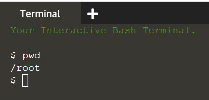

## Basics
You can see the terminal is started on the right section. Let's run our first command. Make sure your keystrokes are on the terminal, then execute the following command:
> `pwd`{{execute}}

You should see a directory path printed out (probably something like `/root`).

From the picture, we have a couple of basics to understand. 
- The $ (**_prompt_**) is there to tell you the terminal is ready to accept a command. 
- Output will directly show in the terminal after executed commands.

 

## The importance of case
Be extra careful with case when typing in the command line. Typing `PWD` instead of `pwd` will produce an error, but sometimes the wrong case can result in a command appearing to run, but not doing what you expected.

 

## A sense of location
Now to the command itself. `pwd` is an abbreviation of ‘**p**rint **w**orking **d**irectory’. All it does is print out the shell’s current _working directory_. One important concept to understand is that the shell has a notion of a default location in which any file operations will take place. 

If you do any actions, the shell will assume the actions perform in the current working directory unless you take steps to specify otherwise. Therefore, keep in mind of what directory the shell is in at anytime, especially when you want to delete files. If you have any doubt, the `pwd` command will tell you exactly what the current working directory is.

 
