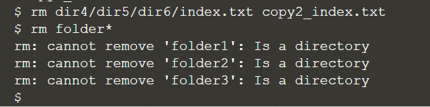

## Deleting files and folders

At this stage, we will delete files:
> ```
> rm dir4/dir5/dir6/index.txt copy2_index.txt
> ```{{execute}}

And we can try to delete directories:
> ```
> rm folder*
> ```{{execute}}

Sample output:



As we used wildcard character "*" in the directory removal, the system has triggered a safety net to prevent accidental delete. As a result, in order to remove a directory (after serious consideration), we can use `rmdir` command to do the job:
> ```
> rmdir folder*
> ls
> ```{{execute}}

<br/>

Nevertheless, we can still see an error from the terminal, saying "failed to remove 'folder3': Directory not empty". It is because **_folder3_** contains **_folder4_**, so the system may want to safeguard the directories with files or folders will not be deleted that easily. If you are really sure to remove a whole directory and anything within it, we add the `-r` switch:
> ```
> rm -r folder3
> ls
> ```{{execute}}

Remember: although `rm -r` is quick and convenient, it’s also dangerous. It’s safest to explicitly delete files to clear out a directory, then `cd ..` to the parent before using `rmdir` to remove it.

<br/>
