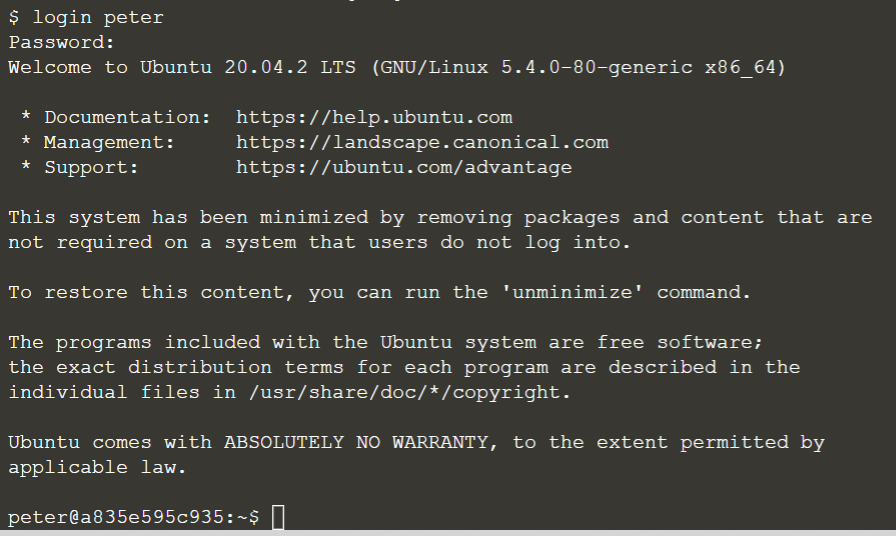

## Create users and login

In Linux terminal, we can create user account to access stored files and folders privately. Let us create a username '**peter**':
> `adduser peter`{{execute}}

The system will inform you to set the password for the user account, and also the user information. For the password, use '**12345**'; for the user information, just click <kbd> ENTER </kbd> for the default. Remember to input Y at last.

Sample output:

Then, we will login as the user 'peter'. Remember the password is '**12345**'.
> `login peter`{{execute}}

Sample output:

As you can see after we login the user account, the terminal will change to indicate the user (for example **peter@a835e595c935** in the sample output). All the commands executed during the login will only be saved in the private account. The public account cannot see the files.

To return to the public account, type 'exit' to leave:
> `exit`{{execute}}

 
