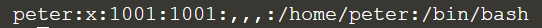

## Viewing local user information

Details of local users can be found in the **/etc/passwd** file. 
> ```
> less /etc/passwd
> ```{{execute}}

Each line represents one user and has seven fields:
1. Username (peter)
2. The encrypter password (represented by x, located in the /etc/shadow file)
3. User ID number (known as UID: 1001)
4. User group ID (known as GID: 1001)
5. User full name
6. User home directory (/home/peter)
7. The login shell (by default set to bin/bash)

Sample output:



You can see in the sample output, all information is shown, but sometimes we only want the usernames on the system. As a result, we can extract from the list:
> `cut -d: -f1 /etc/passwd`{{execute}}

There are two switches used in this execution:
1. `-d`: indicate a specific symbol to be field delimiter (In this case, ':' is the symbol)
2. `-f`: select the field that contains no delimiter character, and according to the selected field (In this case, the first field is selected.)

We can also search for existing Linux users by:
> `getent passwd <username>`{{copy}}

<br/>
