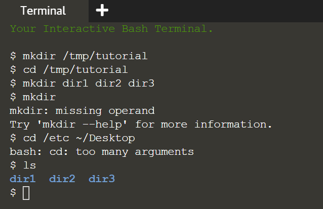

In this section we’re going to create some real files to work with. To avoid accidentally trampling over any of your real files, we’re going to start by creating a new directory, well away from your home folder, which will serve as a safer environment in which to experiment:
> ```
> mkdir /tmp/tutorial
> cd /tmp/tutorial
> ```{{execute}}

Notice the use of an absolute path, to make sure that we create the tutorial directory inside /tmp. Without the forward slash at the start the `mkdir` command would try to find a tmp directory inside the current working directory, then try to create a tutorial directory inside that. If it couldn’t find a tmp directory the command would fail.

In case you hadn’t guessed, `mkdir` is short for ‘make directory’. Now that we’re safely inside our test area (double check with `pwd` if you’re not certain), let’s create a few subdirectories:
> `mkdir dir1 dir2 dir3`{{execute}}

There’s something a little different about that command. So far we’ve only seen commands that work on their own (`cd`, `pwd`) or that have a single item afterwards (`cd /`, `cd ~/Desktop`). But this time we’ve added three things after the `mkdir` command. Those things are referred to as parameters or arguments, and different commands can accept different numbers of arguments. The `mkdir` command expects at least one argument, whereas the `cd` command can work with zero or one, but no more. See what happens when you try to pass the wrong number of parameters to a command:
> ```
> mkdir
> cd /etc ~/Desktop
> ```{{execute}}

Back to our new directories. The command above will have created three new subdirectories inside our folder. Let’s take a look at them with the `ls` (list) command:
> `ls`{{execute}}

If you’ve followed the last few commands, your terminal should be looking something like this:



Notice that `mkdir` created all the folders in one directory. It didn’t create dir3 inside dir2 inside dir1, or any other nested structure. But sometimes it’s handy to be able to do exactly that, and `mkdir` does have a way:
> ```
> mkdir -p dir4/dir5/dir6
> ls
> ```{{execute}}

This time you’ll see that only dir4 has been added to the list, because dir5 is inside it, and dir6 is inside that. Later we’ll install a useful tool to visualise the structure, but you’ve already got enough knowledge to confirm it:
> ```
> cd dir4
> ls
> ```{{execute}}
> ```
> cd dir5
> ls
> ```{{execute}}
> `cd ../..`{{execute}}

The “-p” that we used is called an option or a switch (in this case it means “create the parent directories, too”). Options are used to modify the way in which a command operates, allowing a single command to behave in a variety of different ways. Unfortunately, due to quirks of history and human nature, options can take different forms in different commands. You’ll often see them as single characters preceded by a hyphen (as in this case), or as longer words preceded by two hyphens. The single character form allows for multiple options to be combined, though not all commands will accept that. And to confuse matters further, some commands don’t clearly identify their options at all, whether or not something is an option is dictated purely by the order of the arguments! You don’t need to worry about all the possibilities, just know that options exist and they can take several different forms. For example the following all mean exactly the same thing:
> ```
> mkdir --parents --verbose dir4/dir5
> mkdir -p --verbose dir4/dir5
> mkdir -p -v dir4/dir5
> mkdir -pv dir4/dir5
> ```

Now we know how to create multiple directories just by passing them as separare arguments to the `mkdir` command. But suppose we want to create a directory with a space in the name? Let’s give it a go:
> ```
> mkdir another folder
> ls
> ```{{execute}}

You probably didn’t even need to type that one in to guess what would happen: two new folders, one called another and the other called folder. If you want to work with spaces in directory or file names, you need to escape them. Don’t worry, nobody’s breaking out of prison; escaping is a computing term that refers to using special codes to tell the computer to treat particular characters differently to normal. Enter the following commands to try out different ways to create folders with spaces in the name:
> ```
> mkdir "folder 1"
> mkdir 'folder 2'
> mkdir folder\ 3
> mkdir "folder 4" "folder 5"
> mkdir -p "folder 6"/"folder 7"
> ls
> ```{{execute}}

Although the command line can be used to work with files and folders with spaces in their names, the need to escape them with quote marks or backslashes makes things a little more difficult. You can often tell a person who uses the command line a lot just from their file names: they’ll tend to stick to letters and numbers, and use underscores (“_”) or hyphens (”-”) instead of spaces.

<br/>
