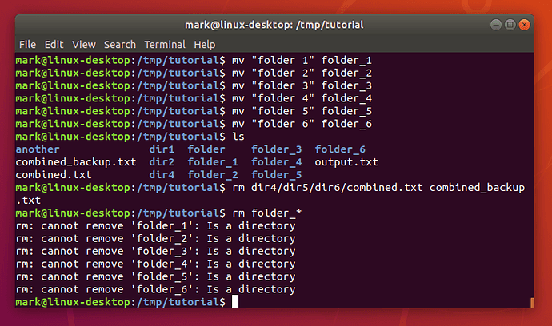

## Warning
In this next section we’re going to start deleting files and folders. To make absolutely certain that you don’t accidentally delete anything in your home folder, use the `pwd` command to double-check that you’re still in the _/tmp/tutorial_ directory before proceeding.

Now we know how to move, copy and rename files and directories. Given that these are just test files, however, perhaps we don’t really need three different copies of _combined.txt_ after all. Let’s tidy up a bit, using the `rm` (remove) command:
> `rm dir4/dir5/dir6/combined.txt combined_backup.txt`{{execute}}

Perhaps we should remove some of those excess directories as well:
> `rm folder_*`{{execute}}



What happened there? Well, it turns out that rm does have one little safety net. Sure, you can use it to delete every single file in a directory with a single command, accidentally wiping out thousands of files in an instant, with no means to recover them. But it won’t let you delete a directory. I suppose that does help prevent you accidentally deleting thousands more files, but it does seem a little petty for such a destructive command to balk at removing an empty directory. Luckily there’s an `rmdir` (remove directory) command that will do the job for us instead:
> ```
> rmdir folder_*
> ls
> ```{{execute}}

`rmdir` will only delete empty folders. Again, it’s a small safety net to prevent you from accidentally deleting a folder full of files when you didn’t mean to.

However, if we would like to delete folders including files, we need to use `rm -r`:
> ```
> mkdir "folder 1"/"folder 2"
> ls "folder 1"
> rm -r "folder 1"
> ls
> ```{{execute}}

Remember: although `rm -r` is quick and convenient, it’s also dangerous. It’s safest to explicitly delete files to clear out a directory, then `cd ..` to the parent before using rmdir to remove it.

## Important Warning
Unlike graphical interfaces, `rm` doesn’t move files to a folder called “trash” or similar. Instead it deletes them totally, utterly and irrevocably. You need to be ultra careful with the parameters you use with `rm` to make sure you’re only deleting the file(s) you intend to. You should take particular care when using wildcards, as it’s easy to accidentally delete more files than you intended. An errant space character in your command can change it completely: `rm t*` means “delete all the files starting with **t”**, whereas `rm t *` means “delete the file t as well as any file whose name consists of zero or more characters, which would be everything in the directory! If you’re at all uncertain use the `-i` (interactive) option to `rm`, which will prompt you to confirm the deletion of each file; enter **Y** to delete it, **N** to keep it, and press **Ctrl-C** to stop the operation entirely.

<br/>
