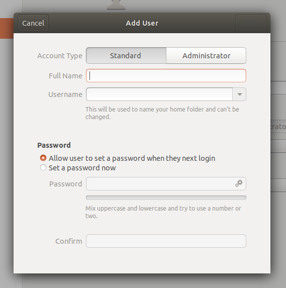
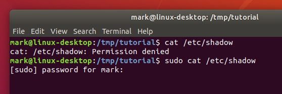

On a Ubuntu system the first user created when the system is installed is considered to be the superuser. When adding a new user there is an option to create them as an administrator, in which case they will also be able to run superuser commands with `sudo`. In this screenshot of Ubuntu 18.04 you can see the option at the top of the dialog:



Assuming you’re on a Linux system that uses `sudo`, and your account is configured as an administrator, try the following to see what happens when you try to access a file that is considered sensitive (it contains encrypted passwords):
> ```
> cat /etc/shadow
> sudo cat /etc/shadow
> ```{{execute}}



If you enter your password when prompted you should see the contents of the `/etc/shadow` file. Now clear the terminal by running the `reset` command, and run `sudo cat /etc/shadow` again. This time the file will be displayed without prompting you for a password, as it’s still in the cache.

## Be careful with sudo
If you are instructed to run a command with `sudo`, make sure you understand what the command is doing before you continue. Running with `sudo` gives that command all the same powers as a superuser. For example, a software publisher’s site might ask you to download a file and change its permissions, then use `sudo` to run it. Unless you know exactly what the file is doing, you’re opening up a hole through which malware could potentially be installed onto your system. `sudo` may only run one command at a time, but that command could itself run many others. Treat any new use of `sudo` as being just as dangerous as logging in as _root_.

For instructions targeting Ubuntu, a common appearance of `sudo` is to install new software onto your system using the `apt` or `apt-get` commands. If the instructions require you to first add a new software repository to your system, using the `apt-add-repository` command, by editing files in `/etc/apt`, or by using a “PPA” (Personal Package Archive), you should be careful as these sources are not curated by Canonical. But often the instructions just require you to install software from the standard repositories, which should be safe.

<br/>
