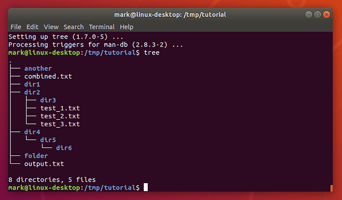

Let’s install a new command line program from the standard Ubuntu repositories to illustrate this use of `sudo`:
> `sudo apt install tree`{{execute}}

Once you’ve provided your password the `apt` program will print out quite a few lines of text to tell you what it’s doing. The `tree` program is only small, so it shouldn’t take more than a minute or two to download and install for most users. Once you are returned to the normal command line prompt, the program is installed and ready to use. Let’s run it to get a better overview of what our collection of files and folders looks like:
> ```
> cd /tmp/tutorial
> tree
> ```{{execute}}



Going back to the command that actually installed the new program (`sudo apt install tree`) it looks slightly different to those you’ve see so far. In practice it works like this:

1. The `sudo` command, when used without any options, will assume that the first parameter is a command for it to run with superuser privileges. Any other parameters will be passed directly to the new command. `sudo`’s switches all start with one or two hyphens and must immediately follow the `sudo` command, so there can be no confusion about whether the second parameter on the line is a command or an option.

2. The command in this case is `apt`. Unlike the other commands we’ve seen, this isn’t working directly with files. Instead it expects its first parameter to be an instruction to perform (`install`), with the rest of the parameters varying based on the instruction.

3. In this case the `install` command tells `apt` that the remainder of the command line will consist of one or more package names to install from the system’s software repositories. Usually this will add new software to the machine, but packages could be any collection of files that need to be installed to particular locations, such as fonts or desktop images.

You can put `sudo` in front of any command to run it as a superuser, but there’s rarely any need to. Even system configuration files can often be viewed (with `cat` or `less`) as a normal user, and only require _root_ privileges if you need to edit them.

## Installing new software
There are lots of different ways to install software on Linux systems. Installing directly from your distro’s official software repositories is the safest option, but sometimes the application or version you want simply isn’t available that way. When installing via any other mechanism, make sure you’re getting the files from an official source for the project in question.

Indications that files are coming from outside the distribution’s repositories include (but are not limited to) the use of any of the following commands: `curl`, `wget`, `pip`, `npm`, `make`, or any instructions that tell you to change a file’s permissions to make it executable.

Increasingly, Ubuntu is making use of “snaps”, a new package format which offers some security improvements by more closely confining programs to stop them accessing parts of the system they don’t need to. But some options can reduce the security level so, if you’re asked to run `snap install` with any parameters other than the name of the snap, it’s worth checking exactly what the command is trying to do.

## Beware of sudo su
One trick with `sudo` is to use it to run the `su` command. This will give you a root shell even if the root account is disabled. It can be useful when you need to run a series of commands as the superuser, to avoid having to prefix them all with `sudo`, but it opens you up to exactly the same kind of problems that were described for `su` above. If you follow any instructions that tell you to run `sudo su`, be aware that every command after that will be running as the _root_ user.

In this section you’ve learnt about the dangers of the _root_ account, and how modern Linux systems like Ubuntu try to reduce the risk of danger by using `sudo`. But _any_ use of superuser powers should be considered carefully. When following instructions you find online you should now be in a better position to spot those commands that might require greater scrutiny.

<br/>
