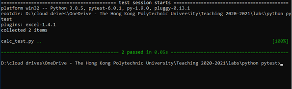
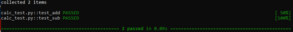
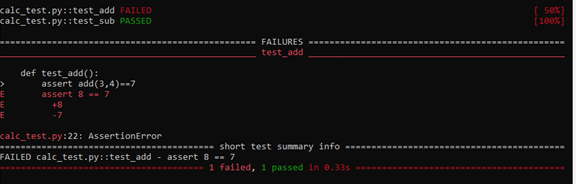

## Basics

Pytest is a testing framework which allows us to write automated test codes using python.  Automated test is an important element in modern software development with continuous integration/delivery (CI/CD) where tests are run automatically when developer check in new code to your code repository.

Install pytest in command prompt:
> `pip install pytest`{{execute}}

Create a script **calc_script.py** as follow. Wait until the file is saved:

<pre class="file" data-filename="calc_script.py" data-target="replace">
import pytest

def add(x,y):
    return x+y+1

def sub(x,y):
    return x-y

def test_add():
    assert add(3,4)==7

def test_sub():
    assert sub(3,4)==-1
</pre>

Execute the tests:
> `pytest calc_script.py`{{execute}}

Sample output:

Each dot represents a passed test case.

The `-v` option produces more detailed (verbose) output:

Modify the add function as follows to introduce a bug.

<pre class="file" data-filename="calc_script.py" data-target="replace">
def add(x,y):
    return x+y+1
</pre>

Execute the tests:
> `pytest -v calc_test.py`{{execute}}

**_Exercise_**: Correct the bug and execute the tests to make sure the tests are passed.

 
