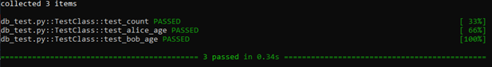

## Test Setup and Teardown

Similarly, the functions **setup_method()** and **teardown_method()** are called before and after all test methods of the class are called. The functions can be used for initialization (e.g. setting up connection to databases, creating test data) before the test cases are executed and clean up (e.g. closing connection to databases, cleaning up the test data).

Define **test_db.py** as follows:

<pre class="file" data-filename="test_db.py" data-target="replace">
import pytest, sqlite3

class TestClass():
    def setup_class(self):
        self.conn = sqlite3.connect("demo.db")
        self.conn.row_factory = sqlite3.Row
        
        self.c = self.conn.cursor()
        self.c.execute("DROP TABLE IF EXISTS users")
        self.c.execute('''
            CREATE TABLE users
            (id INTEGER PRIMARY KEY AUTOINCREMENT, 
            name text, age integer)''')
        
        self.c.execute("INSERT INTO users (name, age) VALUES ('Alice', 18)")
        self.c.execute("INSERT INTO users (name, age) VALUES ('Tom', 25)")
        self.conn.commit()
        
    def teardown_class(self):
        self.c.execute("DROP TABLE IF EXISTS users")
        self.conn.close()

    def test_count(self): 
        self.c.execute("SELECT * FROM users")
        rows = self.c.fetchall()
        assert len(rows) == 2
        
    def test_alice_age(self): 
        self.c.execute("SELECT age FROM users where name='Alice'")
        rows = self.c.fetchall()
        assert rows[0]['age'] == 18 
        
    def test_bob_age(self): 
        self.c.execute("SELECT age FROM users where name='Tom'")
        rows = self.c.fetchall()
        assert rows[0]['age'] == 25
        
</pre>

Execute the tests:
> `pytest -v test_db.py`{{execute}}

Sample output:

 
